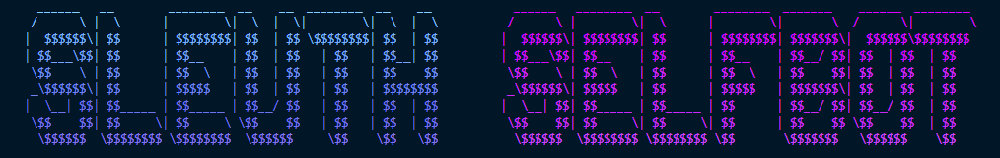
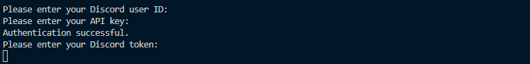

  <h1>Sleuth | Self Bot™</h1>
  

## Features

- Snipe: Retrieve deleted messages.
- Ping: Display the bot's latency.
- Random: Generate a random number within a specified range.
- PFP: Display the profile picture of a member.
- GetUser: Retrieve information about a user's Discord account.

## Screenshots

Welcome to Sleuth | Self Bot!

Developed by Zaytonator
Copyright © 2023 Zachary Ayton

**Important Notice:** All rights reserved. This code is protected under copyright law and is not for individual distribution, modification, sale, or any form of unauthorized use. Unauthorized use may result in legal action and penalties as per applicable laws. By using this bot, you agree to comply with these terms and respect the developer's intellectual property rights.

## Discord Server

Join our Discord server for updates, support, and discussions:
[Discord Server Invite Link](https://discord.gg/your_invite_link_here)
